# GothamSubway : 지하철 통계 프로그램

# 개요

- C# .NET Framework와 EntityFramework 및 DevExpress를 이용해 지하철 관련 정보를 차트로 출력하는 기능을 구현하였다.

# 개발 기간

- 2020년 12월 14일 ~ 2020년 12월 20일

# 참여 인원

- IoT기반 스마트팩토리 SW개발 전문가과정
- 김대근, 안성윤, 이동희 총 3명

# 주요 기능

## 출력 기능

### 월별 승하차 승객 수

<div>
<a href="./Document/주요기능/승하차_연도별.png" target="_blank">
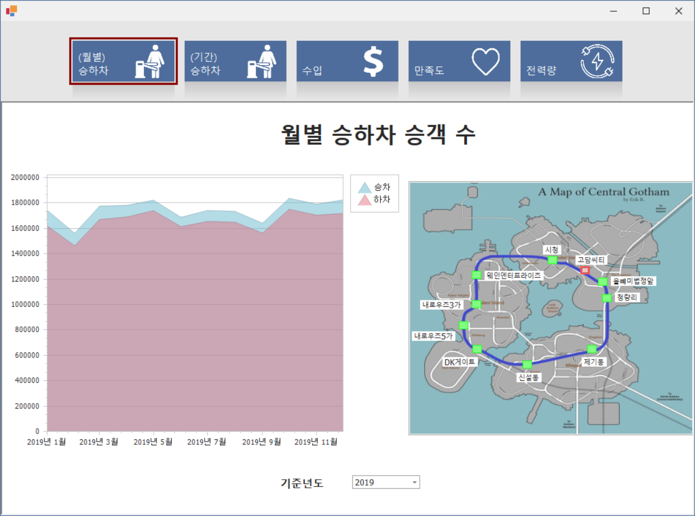
</a>
<a href="./Document/주요기능/승하차_월별_역별.png" target="_blank">
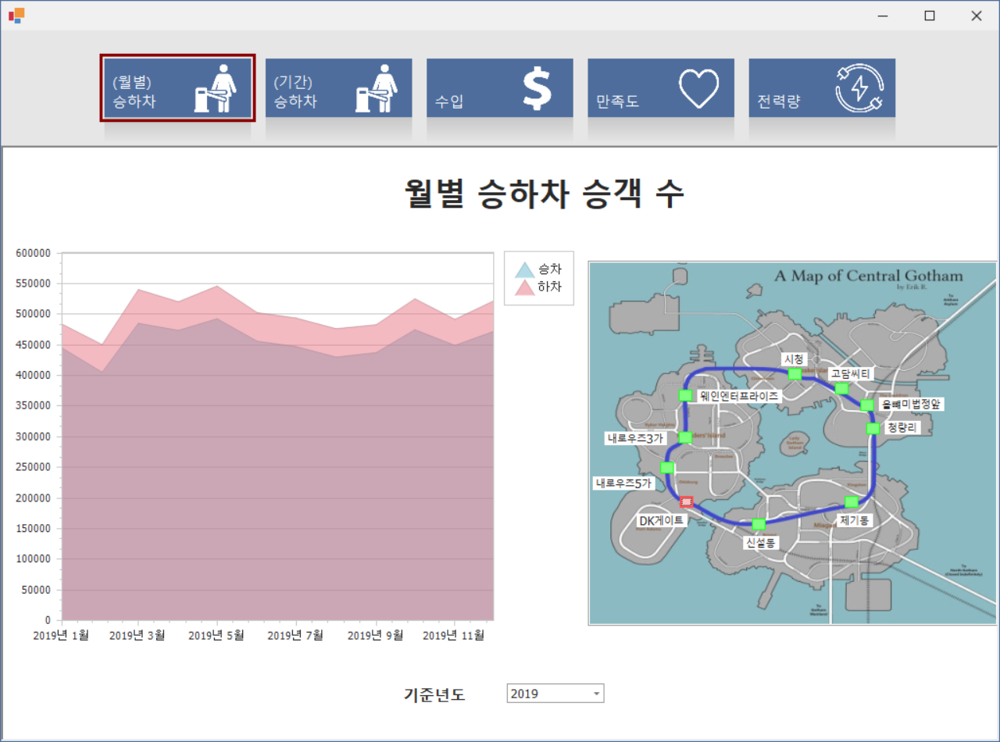
</a>
</div>

- 년도별, 역별


### 선택기간 승하차 승객 수

<div>
<a href="./Document/주요기능/기간별_승하차_기간설정.png" target="_blank">
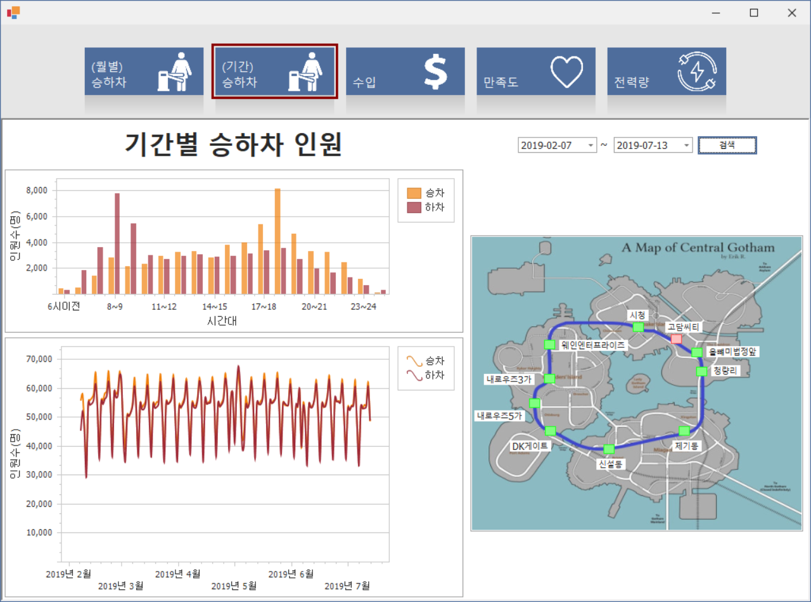
</a>
<a href="./Document/주요기능/기간별_승하차_연도별.png" target="_blank">
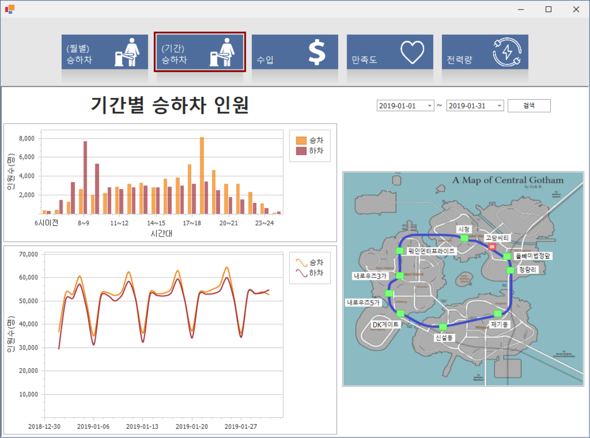
</a>
<a href="./Document/주요기능/기간별_승하차_유효성검사.png" target="_blank">
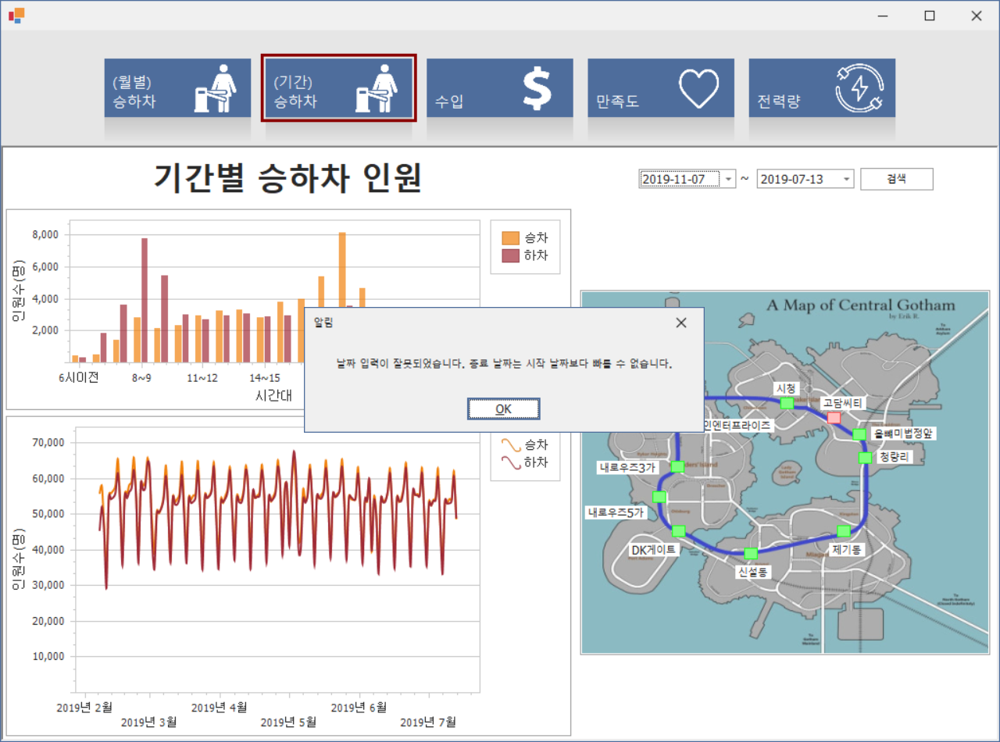
</a>
</div>

- 선택된 기간 기준, 일별, 시간별

### 지하철역별 여객수입


<a href="./Document/주요기능/수입_연도별.png" target="_blank">
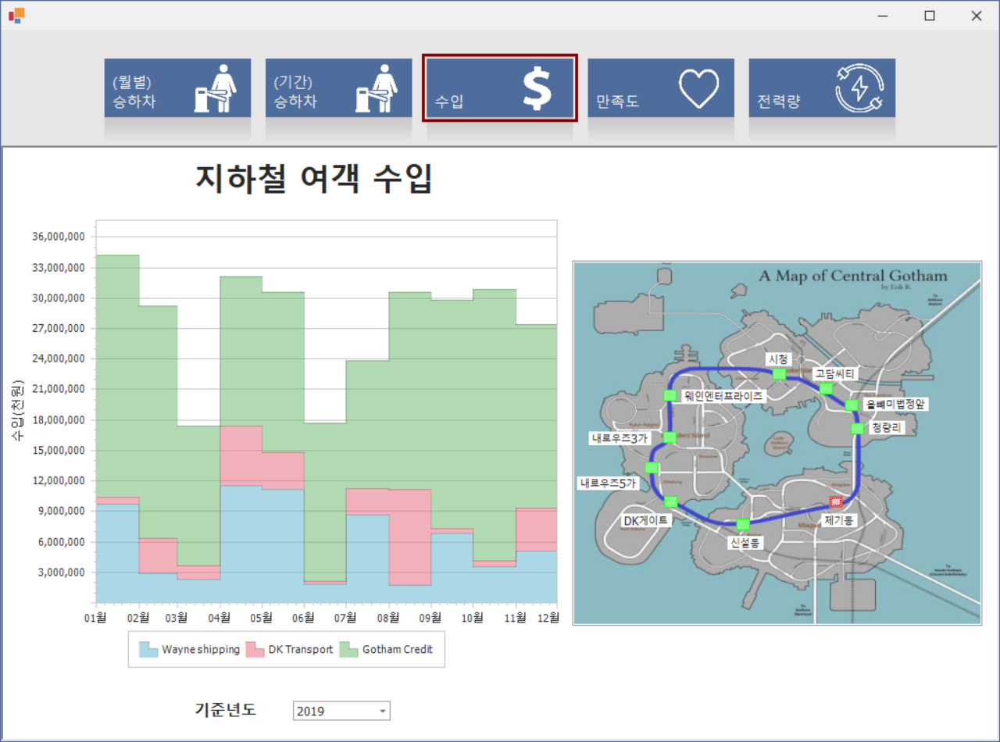
</a>

- 월별, 역별, 회사별(카드회사)

### 분류별 만족도

<div>
<a href="./Document/주요기능/만족도_연도별.png" target="_blank">
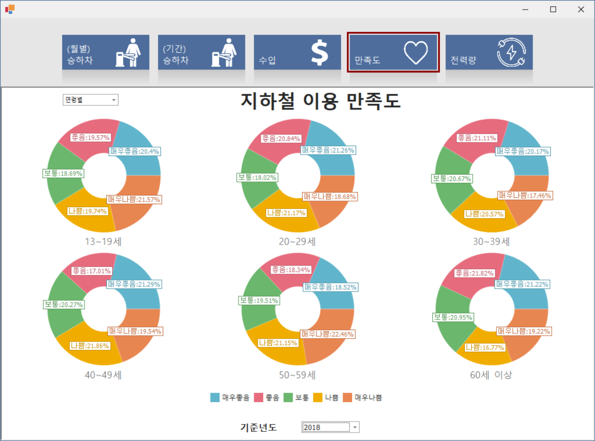
</a>
<a href="./Document/주요기능/만족도_카테고리별.png" target="_blank">
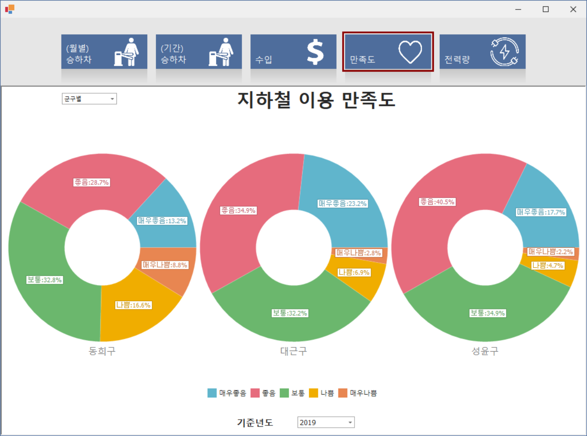
</a>
</div>

- 군구별, 성별, 연령별, 학력별, 직업별, 월평균소득별

### 지하철 전체 전력 사용량 및 전기요금

<a href="./Document/주요기능/전력량_연도별.png" target="_blank">
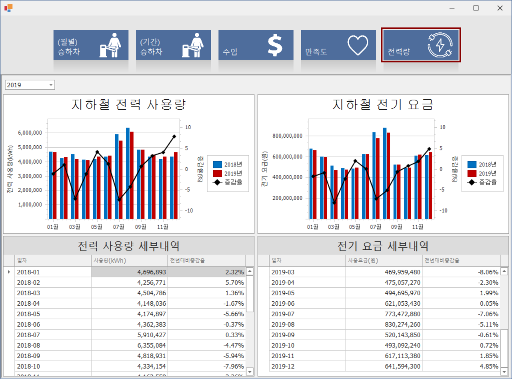
</a>

- 년도별

## 입력 기능

- Excel(.xls).csv 파일 DB 저장 기능

<a href="./Document/주요기능/파일임포터.jpg" target="_blank">
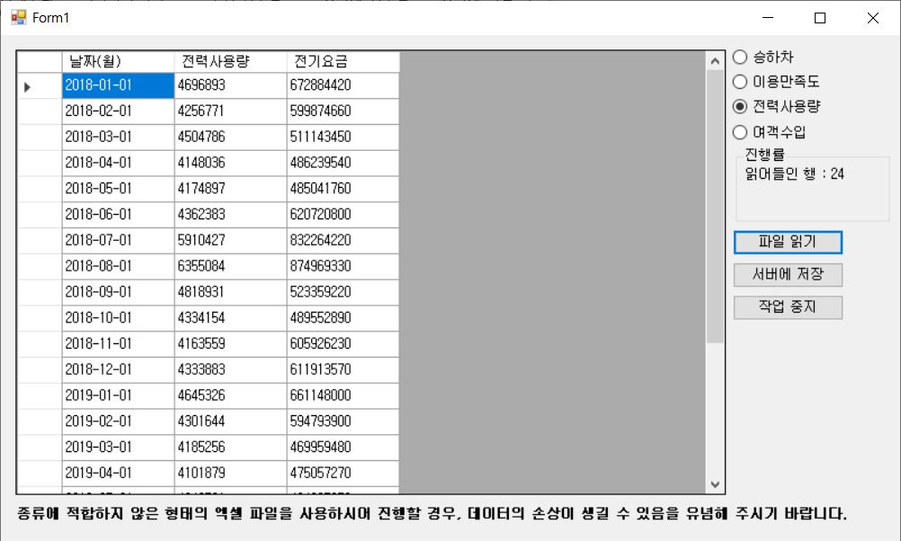
</a>

- 해당 형식의 파일 선택 후 서버(DB)에 저장 가능

# 사용 기술

## 언어

- C# 8.0

## 프레임워크

- .Net FrameWork 4.8
- EntityFrameWork 6.2
- Winform

## 데이터베이스

* MSSQL Server 2019

## Third Party

- DevExpress 20.2.3 (Trial Version)

## 기타 개발환경

- Windows 10
- Microsoft Visual Studio Community 2019 v16.8
- Microsoft SQL Server Management Studio v18.6

# 데이터베이스 스키마

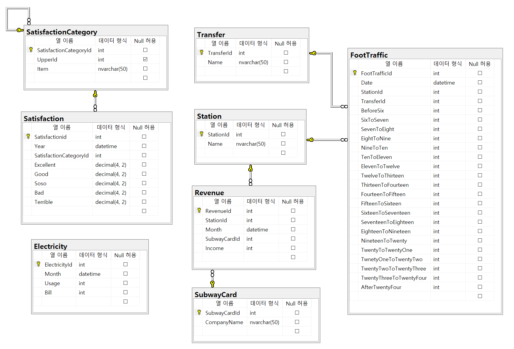

- 모든 항목이 제 3 정규화까지 완료됐다

# 유저 케이스 다이어그램

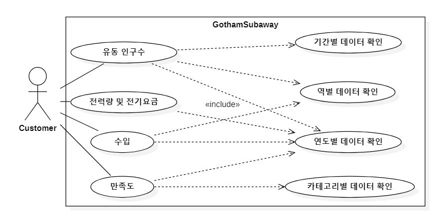

# 플로우차트

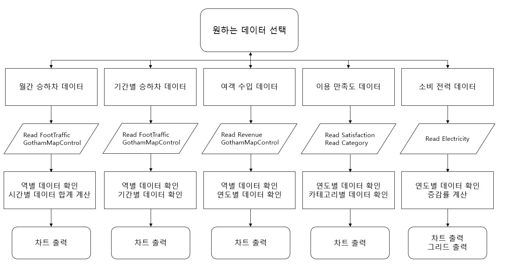

# 클래스 다이어그램

## DAO(Data Access Object)

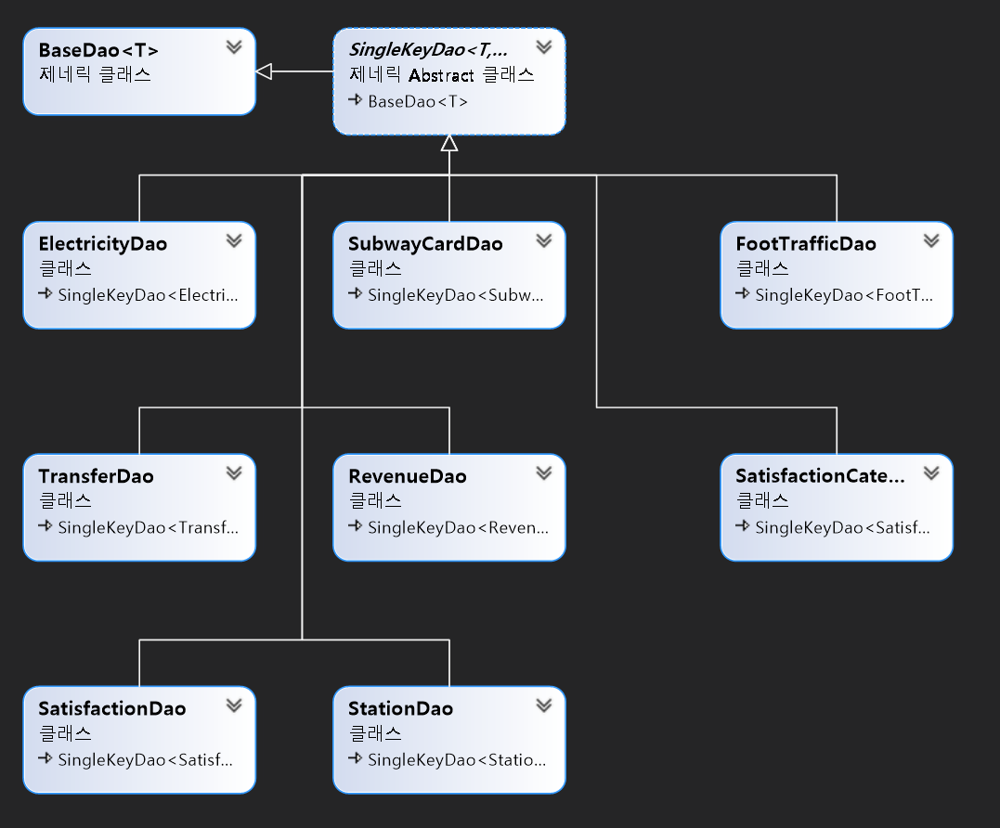

# 시퀸스 다이어그램

## 여객 수입 시퀸스

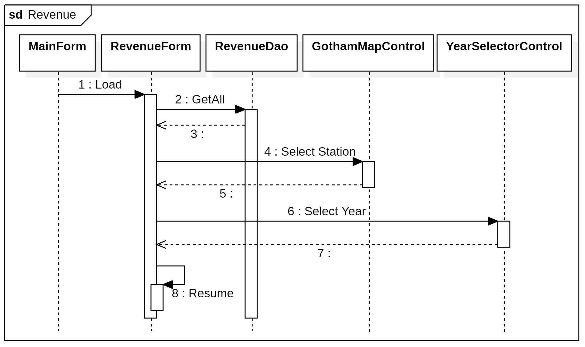

# Point of Interest

# TablePanel 사용법에 관한 이슈 [#31](https://github.com/dlehd333/GothamSubway/issues/31)

## 증상(문제)

- TablePanel을 사용해 Form의 공간할당이 원하는 대로 되지 않는 문제

## 원인

- DevExpress의 TablePanel을 사용해 Form의 공간 할당을 하려고 했는데, 해당 패널에 컨트롤을 넣으면 무조건 왼쪽 위로 강제 정렬되고 이동이 안된다.
- Anchor를 해제해 봤지만 왼쪽 위에서 왼쪽 가운데로 바뀌었을 뿐, 이동이 안된다.

## 결과(해결방안)

- DevExpress의 메뉴얼을 통해 내가 TableLayoutPanel을 잘못 사용하고 있었음을 알았다. [메뉴얼링크](https://docs.devexpress.com/WindowsForms/114044/controls-and-libraries/form-layout-managers/layout-and-data-layout-controls/table-layout)
- TableLayout 자체가 단순히 패널을 여러개로 나누는 것이 아니라, 엑셀처럼 패널을 셀 단위로 나누고 컨트롤을 셀의 일정 부분(n행 n열)에 넣는 방식이었다.
- 메뉴얼의 예제를 참고하여 세세하게 셀을 나누고, 원하는 부분에 컨트롤을 넣어 셀을 할당해주었다
- 결과적으로 원하는 형태의 레이아웃을 완성했다

## 참고할 코드나 스크린샷


---

# 서로 다른 숫자 형식간의 나눗셈에 관한 이슈 [#37](https://github.com/dlehd333/GothamSubway/issues/37)

## 증상(문제)

- 증감률을 계산하려고 했는데, 계산된 데이터에 계속 0이 출력되는 문제

## 원인

- 증감률 계산을 하는 함수를 설정한 다음, 전기 사용량과 요금의 증감률을 계산하려고 했는데, 증감률에 계속해서 0이 입력되었다.
- 단계별 디버깅을 통해 확인해보려 하였으나, 중단점을 잘못 찍어 원하는 결과를 찾아보지 못했다.

## 결과

- 나눗셈을 할 때 사용되는 숫자가 모두 int형이면 결과값이 int형이 출력되어 소수점이 증발한다(ex. 10/3.7 = 2)
- 나눗셈에 사용되는 숫자 중 최소 1개를 double형으로 캐스팅해야 한다.
- 나누는 변수를 double형으로 캐스팅 하여 해결하였다.

## 참고할 코드나 스크린샷

```csharp
items[i].UsageYoYRate = (items[i].Usage - previousItem.Usage) / previousItem.Usage * 100.0;
items[i].UsageYoYRate = (items[i].Bill - previousItem.Usage) / (double)previousItem.Usage * 100.0;
```

---

# 지하철 노선도 버튼 전달 값 변경 시 값 전달이 되지 않는 문제 [#40](https://github.com/dlehd333/GothamSubway/issues/40)

## 증상(문제)

- 지하철 노선도 버튼 전달 값 변경 시 값 전달이 되지 않는 문제

## 원인

- TransferByMonthForm내에서 사용되는 유저 컨트롤의 이벤트 핸들러가 할당되어 있지 않았음.
- 기존에 할당되어 있었으나 내용이 왜 초기화 되어 있는지 원인을 알아내지 못함.
- 디자인 코드의 내용이 자동으로 계속 변경되면서 이벤트 핸들러가 누락된 것으로 추청됨.

## 결과(해결방안)

- 폼 코드에 직접 이벤트 핸들러를 수동으로 등록하여 해결함

## 참고할 코드나 스크린샷

```csharp
//Codes from TransferByMonthForm.cs
protected override void OnLoad(EventArgs e) // 폼 로드 시 이벤트
{
    base.OnLoad(e);

    gothamMapControl.ButtonClicked +=
        new EventHandler<GothamMapControl1.ButtonClickedEventArgs>(gothamMapControl_ButtonClicked);//맵컨트롤 이벤트 핸들러 할당
}
```

---

# 만족도 페이지 동적 차트 구성에 관한 문제 [#44](https://github.com/dlehd333/GothamSubway/issues/44)

## 증상(문제)

- 작업해야 할 만족도 페이지는 여객수입 페이지와 다르게, 카테고리에 따라 출력할 시리즈의 개수가 바뀌는 문제

## 원인

- 원하는 형태로 데이터를 출력하기 위해 Entity의 모델화 및 동적 시리즈 생성 등 거쳐야 할 과정이 난해했다
- 차트가 익숙하지 않아서 차트(시리즈) 구성에도 애를 먹었다

## 결과(해결방안)

- 수동으로 시리즈를 추가하는 방식 대신 데이터에 맞게 자동으로 시리즈를 생성하는 SeriesTemplate 속성을 발견하여 사용했다
- SeriesTemplate 속성의 하위 속성인 FilterCriteria(FilterString)에서 Or 조건을 추가하면 원하는 카테고리에 맞게 동적으로 시리즈가 생성되는 것을 확인했다
- 이를 이용해 모델화 시켜 바인딩한 데이터를 필터링하여 카테고리 및 연도에 맞는 개별 시리즈가 생성되어 출력되도록 하는 데 성공했다

## 참고할 코드나 스크린샷


---

# DevExpress 버전이 맞지 않는 문제 [#49](https://github.com/dlehd333/GothamSubway/issues/49)

## 증상(문제)

- 추가 작업을 위해 다른 환경에서 작업시 프로젝트가 DevExpress를 인식하지 못하는 문제

## 원인

- 1차 원인은 DevExpress가 12월4일에 20.2.4로 업데이트 되면서 기존에 작업하던 버전과 맞지 않아 생긴 문제였다
- 2차로 다른 팀원이 이미 문제 인식 전날 밤에 DevExpress 버전을 바꿔서 작업을 하고 master에 Merge했다
- 그로 인해 다른 사람들과 버전이 맞지 않아 프로젝트의 일관성을 침해당하고 작업이 어려워지게 되었다

## 결과(해결방안)

- 처음에는 버전 정보가 적힌 licenses.licx 파일 및 .csproj 파일의 버전 정보를 수정하였지만 해결되지 않았다
- 그래서 기존에 사용하던 버전(20.2.3)에 맞는 설치파일을 구해 DevExpress를 재설치하고, DevExpress에서 제공하는 Project Converter를 이용해 프로젝트를 이전 버전으로 다시 Convert하여 동작하는 것을 확인했다
- 하지만 그래도 작동하지 않는 사람이 생겨, 해당 인원은 로컬의 내용을 삭제하고 Github에서 프로젝트를 다시 복제하여 문제를 해결했다

## 참고할 코드나 스크린샷


---

# 백그라운드 프로세스에 Excel 프로그램이 남는 문제 [#56](https://github.com/dlehd333/GothamSubway/issues/56)

## 증상(문제)

- 엑셀 파일 읽기 작업 진행 중 비정상 종료시 백그라운드 프로세스에 Excel이 남아있는 문제

## 원인

- ImportForm에서 엑셀 파일을 읽어올 때 문제가 발생하거나, 작업 중간에 종료하면 윈도우 백그라운드 프로세스에 Excel이 남아있는 문제가 생긴다
- 그래서 엑셀 파일의 임시데이터가 남아있거나, 컴퓨터를 껏다 켜면 프로세스에 남아있던 엑셀이 실행되는 등의 문제가 발생한다

## 결과(해결방안)

- 엑셀 파일을 읽어오는 중에는 종료가 되지 않도록 막고, 작업 중지 기능을 추가함.
- 에러가 발생하거나 작업이 중지될 경우 엑셀 파일을 열기 위해 사용한 핸들러를 해제해 주도록 조치함.

## 참고할 코드나 스크린샷

```c#
// 프로그램 종료 시
protected override void OnClosing(CancelEventArgs e)
{
    _pause.Reset(); // ManualResetEvent 쓰레드로 작업을 일시 정지
    if (bgwLoader.IsBusy || bgwInsert.IsBusy) // 작업중에는 종료 취소
    {
        Utility.Mbox("경고", "작업이 진행중입니다.\n종료하시려면 작업을 완료하시거나 중지해 주세요");
        e.Cancel = true;
    }
    _pause.Set();
    base.OnClosing(e);
}
// BackgroundWorker의 작업이 끝났을 때(오류 발생 및 취소)
private void bgwLoader_RunWorkerCompleted(object sender, RunWorkerCompletedEventArgs e)
{
    if (e.Error != null || e.Cancelled == true)
    {
        ReleaseObject(range);
        ReleaseObject(worksheet);
        ReleaseObject(workbook);
        application.Quit();
        ReleaseObject(application);
        return;
    }
    // ....
}
```